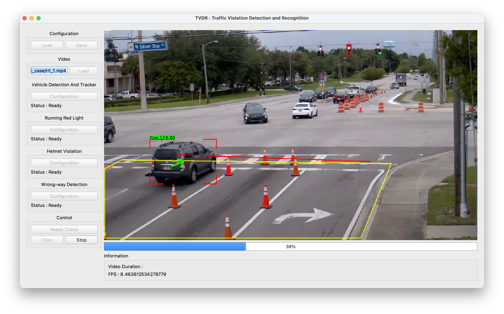

<!-- # TrafficViolationDetection


<h1>
<p align="center">
  
</h1>

 -->


<!-- LOGO -->

<br />
<h1>
<p align="center">
  
  <br>Traffic Violation Detection & Recognition
</h1>
<p align="center">
<a href="https://www.python.org/"></a>
<a href="https://github.com/psf/black"></a>
<!-- <a href="https://colab.research.google.com/drive/1bwnepojzg_1T56IWPee_n998nEh7catM?usp=sharing"></a> -->
</p>


</p>

-----

## 📝 About The Project 
**Traffic Violation Detection & Recognition** is a system built to detect various traffic violations. Currently, this system only supports detecting running red light violation, helmet violation, and wrong-way. We used YOLOv5 as object detection and SORT as object tracker. If you want to know more about the technical details, please go to the system diagram below.

## 🚀 Quickstart
1. Clone our repository
    ```bash
    git clone https://github.com/ilhamfzri/traffic-violation-detection.git
    ```

2. Install requirements
    ```bash
    cd traffic-violation-detection
    pip install -r requirements.txt
    ```
    We recommend you to create an isolated environment using conda.

3. Download our model
      ```bash
    chmod +x download_model.sh
    sh download_model.sh
    ```
    We provided the models for vehicle detection and helmet violation.

4. Run the system
      ```bash
      python main.py
      ```
    <h1>
    <p align="center">
      
    </h1>


##  🔧 System Diagram
<h1>
<p align="center">
  
</h1>